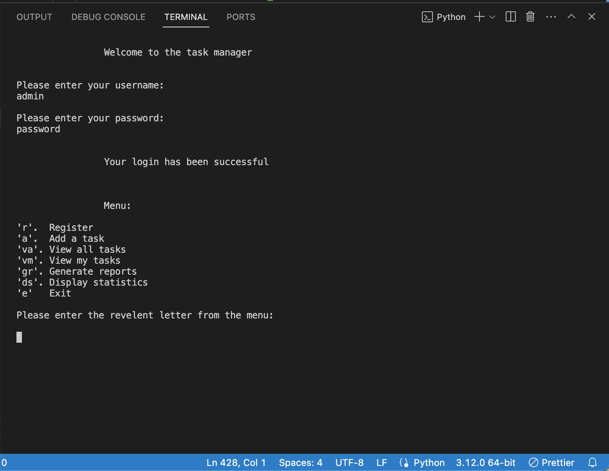
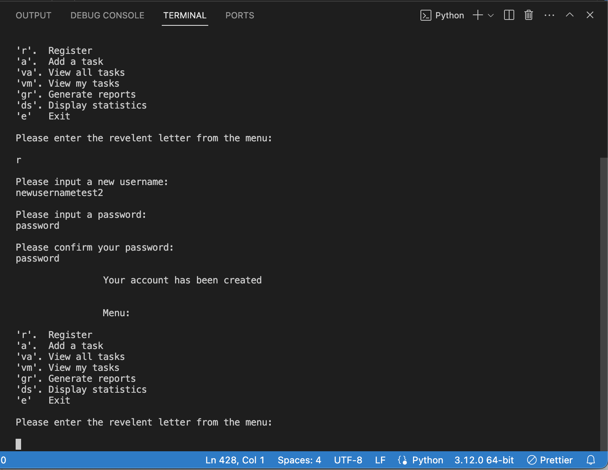
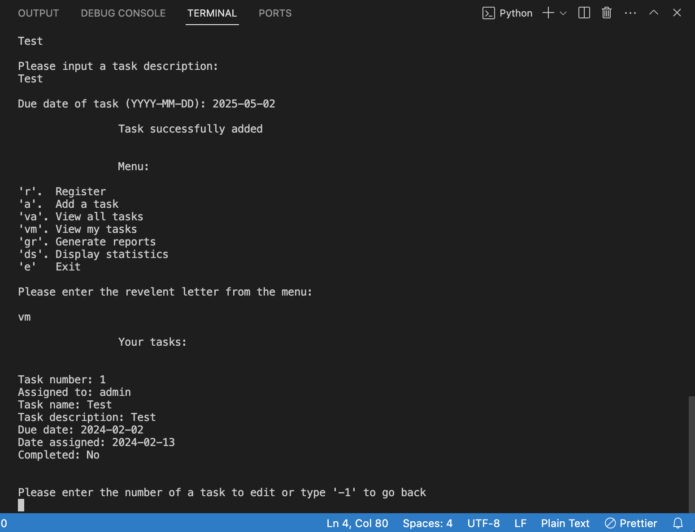
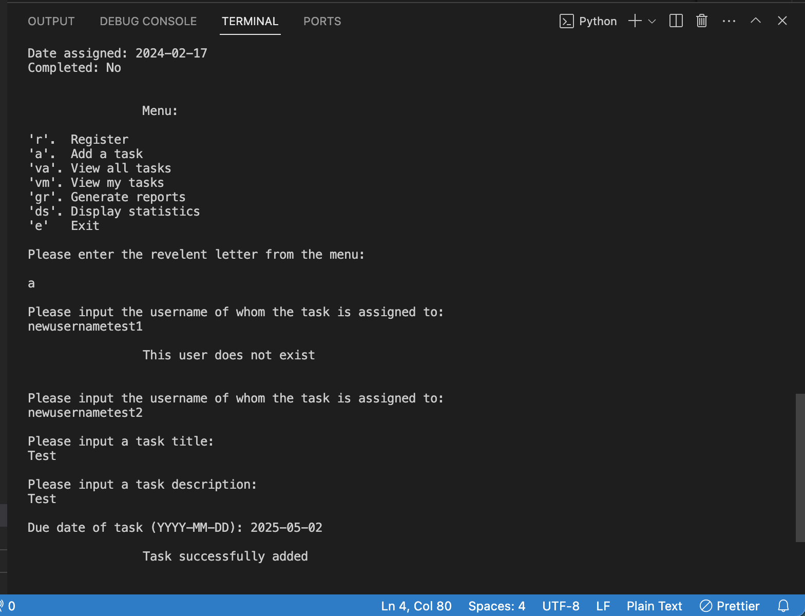
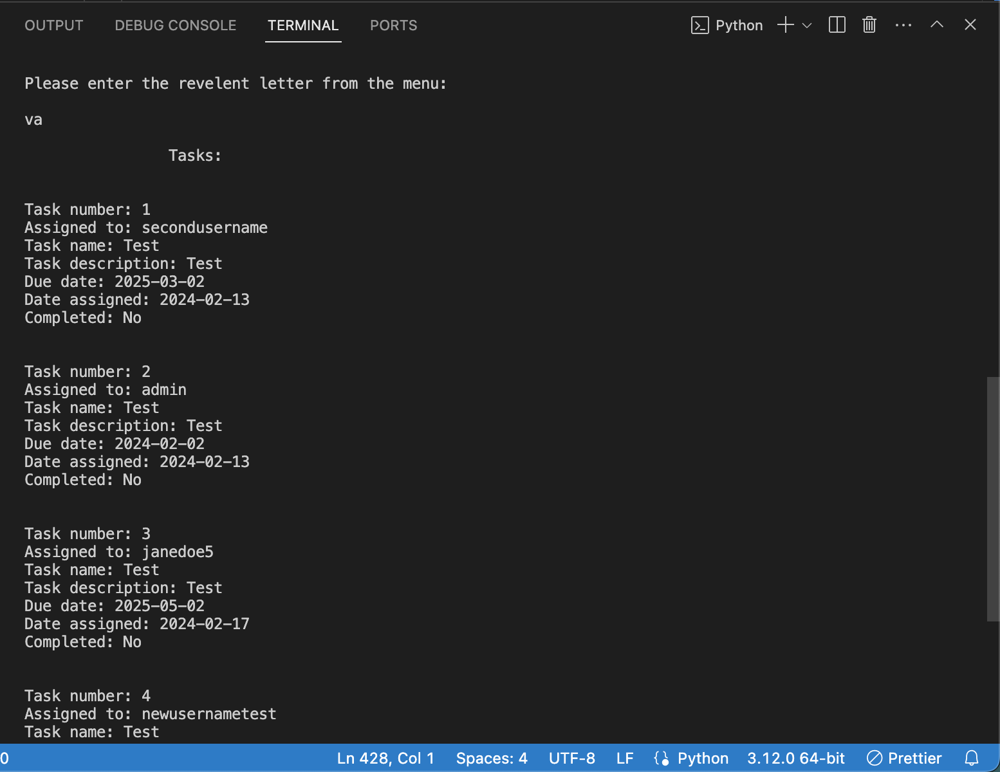
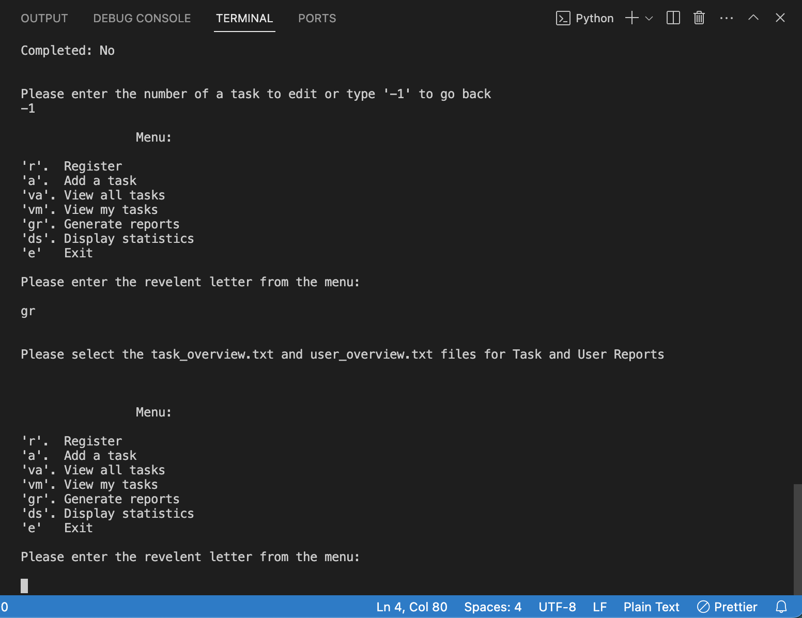
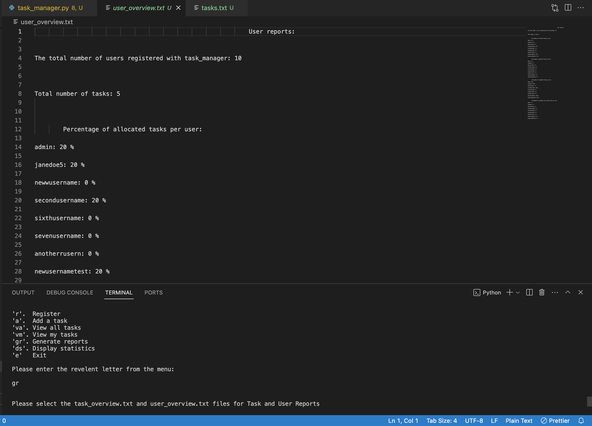
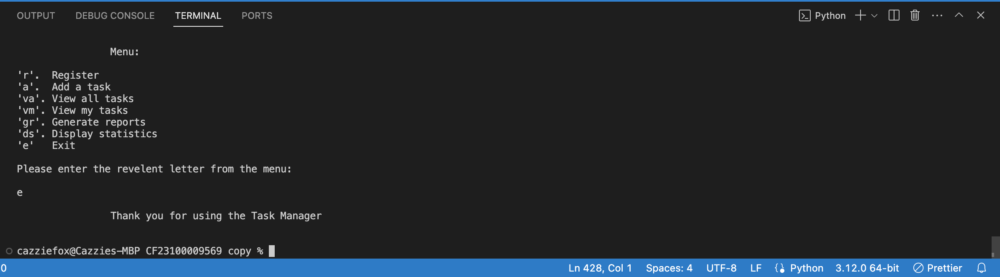
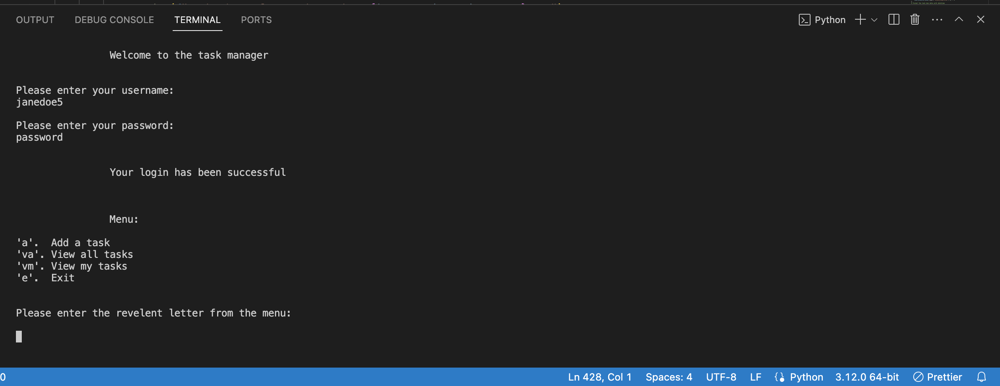
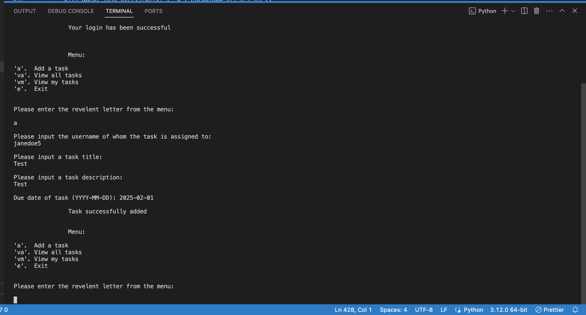

# Task Manager

### A Task Management program which is to be run in a code editor terminal, developed on VScode using Python.

## Description

A program which offers functionality dependant on whether the logged in user is an Administrator or general user.
The Task Manager enables all users to add tasks, view and edit their own tasks, where as there is additional functionality
for the Administrator.

## Languages used

* Python

# Goals

## My Goals as a developer

* To add to and develop the functionality on an existing Task Manager program.
* To incorporate a secure user experience by adding hash to passwords.
* To handle all possible errors with defensive programming.
* To provide clear and concise instructions of how to navigate through the program.
* To ensure that existing and additional functionality works without errors.
* To adhere to coding best practices to maintain easy readability.

## User Goal

### General User

* To use the terminal to log in by entering a username and password.
* To seamlessly navigate through the program using clearly laid out menu options.
* To manage tasks assigned to the logged in user.

### Administrator

* To use the terminal to log in by entering a username and password.
* To seamlessly navigate through the program using clearly laid out menu options.
* To manage tasks assigned to the logged in user.
* To generate reports containing the statistics for Tasks and Users.

# Installation

### It is recommended to download a code editor such as VScode if you don't have one, although you can view this project in a browser.
* Go to https://github.com/cfff226.
* Select the repository.
* Navigate to the green button labeled 'Code'.
* Select 'Download ZIP'.
* Open up your code editor.
* Select 'File' and navigate to 'Open Folder' from the tab at the top of your screen.
* Select the downloaded folder from the pop up window.
* Open the downloaded folder, this will open all files from the zip folder in the code editor.

# Usage

## Admin

* Select the triangular play button in the top right corner of the code editor to start the program

* Enter your username and password

* Enter 'R' to Register a new user
* Enter a password
* Confirm the password

* Enter 'vm' to view the Admin's tasks only

* Enter 'a' to add a new task
* Enter the user whom the task is assigned to
* Enter a task title
* Enter a task description
* Enter a task due date

* Enter 'va' to view all tasks

* Enter 'gr' to generate reports and navigate to user_overview.txt and tasks_overview.txt to view

* Enter 'e' to exit the program

## General user

* Select the triangular play button in the top right corner of the code editor to start the program

* Enter your username and password

* Enter 'a' to add a new task
* Enter the user whom the task is assigned to
* Enter a task title
* Enter a task description
* Enter a task due date

* Enter 'va' to view all tasks

[!VIEW ALL!](task_manager.png/user-view-all.png)

* Enter 'vm' to view only the logged in users tasks
* Enter the number of the task you wish to edit
* Enter an option of how you would like to edit the task
* Enter an option of what about the task you would like to edit

[!VIEW USERS TASKS!](task_manager.png/user-view-m-1.png)
[!EDIT TASK!](task_manager.png/user-edit-task.png)

* Enter 'e' to exit the program

[!EXIT PROGRAM!](task_manager.png/user-exit.png)

# Credits

The initial project was created by Hyperiondev as a basic template to be developed for Task 17 Capstone Project of the Software Engineering Bootcamp. 
